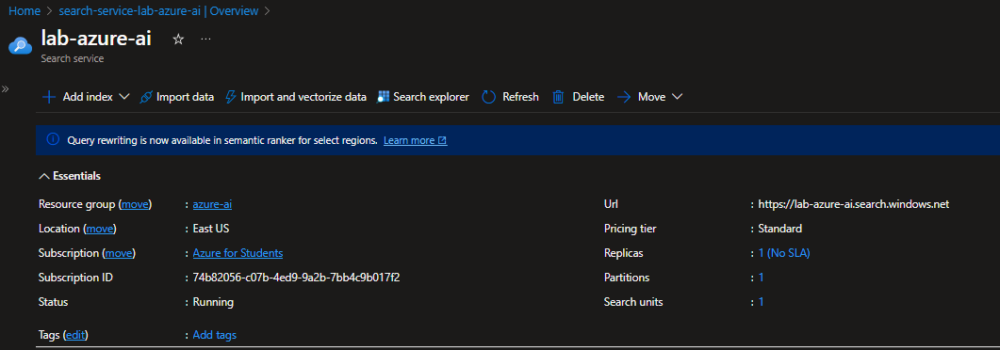
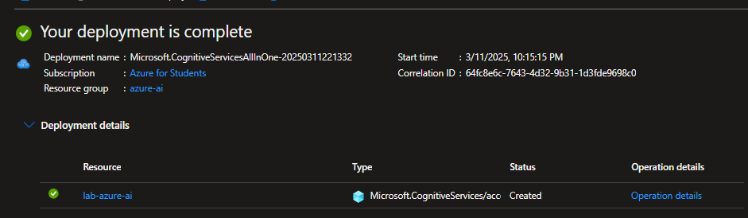
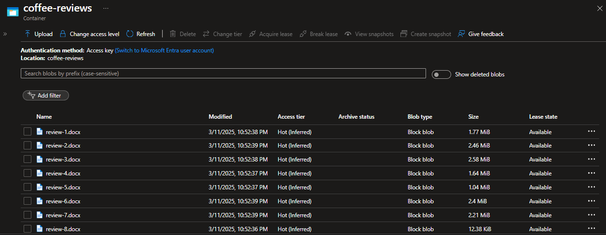
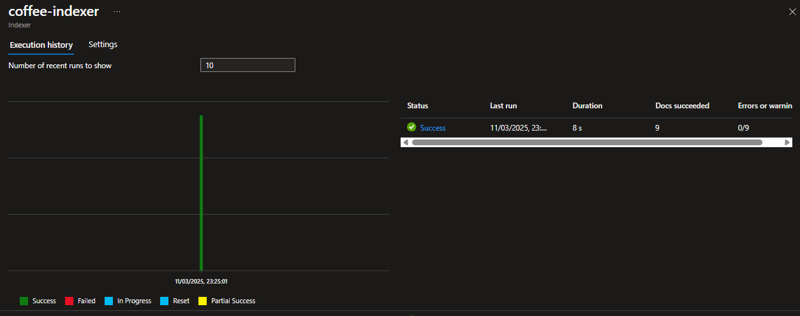
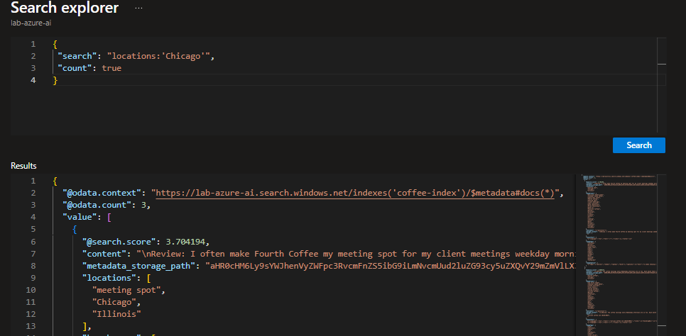
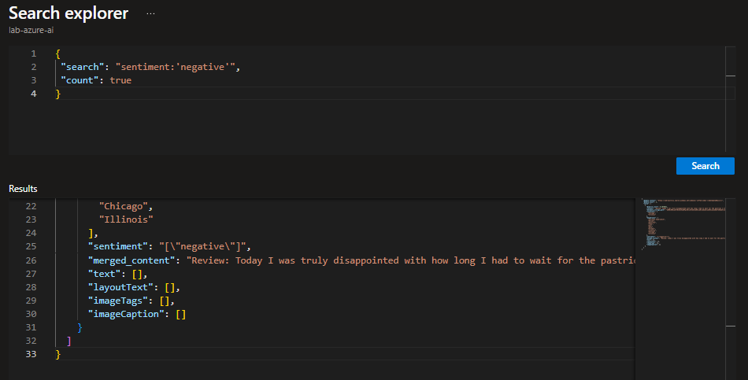

# Explorar um índice (UI) do Azure AI Search

Aqui está o sumário com links para cada seção do seu documento:

## Sumário

- [Explorar um índice (UI) do Azure AI Search](#explorar-um-índice-ui-do-azure-ai-search)
  - [Sumário](#sumário)
  - [Objetivo](#objetivo)
  - [Recursos do Azure necessários](#recursos-do-azure-necessários)
  - [Carregar documentos no Armazenamento do Azure](#carregar-documentos-no-armazenamento-do-azure)
  - [Indexar os documentos](#indexar-os-documentos)
  - [Consultar o índice](#consultar-o-índice)
  - [Resumo](#resumo)
  - [Referência](#referência)

---

## Objetivo

Desenvolvimento de uma solução de mineração de conhecimento para facilitar a pesquisa de insights sobre as experiências dos clientes da Fourth Coffee que é uma rede nacional de cafés. A solução consiste na criação de um índice do Azure AI Search utilizando dados extraídos de avaliações de clientes.

## Recursos do Azure necessários

- Azure AI Search;
  <figure style="text-align: center;">
    
    <figcaption>Recurso Azure AI Search criado.</figcaption>
</figure>
- Serviços de IA do Azure;
  <figure style="text-align: center;">
    
    <figcaption>Recurso Azure AI Services criado.</figcaption>
</figure>
- Uma conta de armazenamento.
  <figure style="text-align: center;">
    
    <figcaption>Recurso Storage Account criado.</figcaption>
</figure>

## Carregar documentos no Armazenamento do Azure

  <figure style="text-align: center;">
    
    <figcaption>Arquivos carregados no Storage Account.</figcaption>
</figure>

## Indexar os documentos
Criando um índice e importando seus documentos de pesquisa do armazenamento para o índice do Azure AI Search.

  <figure style="text-align: center;">
    
    <figcaption>Arquivos indexados com sucesso.</figcaption>
</figure>

## Consultar o índice

Usando o Gerenciador de pesquisa para escrever e testar consultas. O gerenciador de pesquisa é uma ferramenta integrada ao portal do Azure que oferece uma maneira fácil de validar a qualidade do índice de pesquisa.

 Nesse caso, a consulta pesquisa todos os documentos no índice e filtra as revisões com um local de Chicago.

  <figure style="text-align: center;">
    
    <figcaption> Filtrando por localização.</figcaption>
</figure>

E nesse, a consulta pesquisa todos os documentos no índice e filtra as revisões com um sentimento negativo.

  <figure style="text-align: center;">
    
    <figcaption> Filtrando por sentimento.</figcaption>
</figure>

## Resumo

Essa pesquisa simples indexa apenas alguns dos recursos do serviço Azure AI Search. 

Neste Lab foi realizado:
- Criar recursos do Azure;
- Extrair dados de uma fonte de dados;
- Enriqueça os dados com habilidades de IA;
- Usar o indexador do Azure no portal do Azure;
- Consultar seu índice de pesquisa.

## Referência

[Explore an Azure AI Search index (UI)](https://microsoftlearning.github.io/mslearn-ai-fundamentals/Instructions/Labs/11-ai-search.html)

[DIO - Microsoft - Fundamentos de IA](https://web.dio.me/track/microsoft-fundamentos-de-ia)

