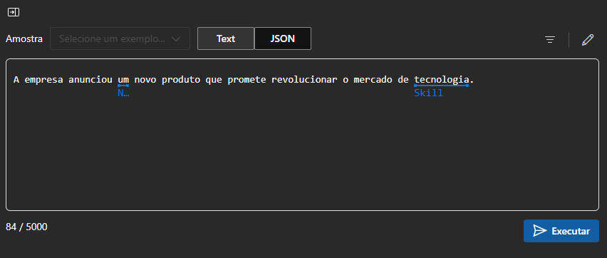

# Analisar texto no portal do Azure AI Foundry

## Descrição

Análise de texto utilizando as ferramentas do portal Azure AI Foundry, com foco na extração de entidades nomeadas e frases-chave. O processo foi realizado a partir da frase "A empresa anunciou um novo produto que promete revolucionar o mercado de tecnologia", empregando o Azure AI Language para identificar entidades significativas e destacar as frases mais relevantes do conteúdo.

## Extraia entidades nomeadas com o Azure AI Language no portal do Azure AI Foundry

<figure style="text-align: center;">
    
    <figcaption>Frase utilizada.</figcaption>
</figure>

<figure style="text-align: center;">
    
    <figcaption>Resultado da frase um</figcaption>
</figure>

<figure style="text-align: center;">
    
    <figcaption>Resultado da frase um</figcaption>
</figure>

## Extraia frases-chave com o Azure AI Language no portal do Azure AI Foundry

<figure style="text-align: center;">
    
    <figcaption>Frases chaves extraidas.</figcaption>
</figure>

# Resumo
**Resumo Final:**

A análise do texto "A empresa anunciou um novo produto que promete revolucionar o mercado de tecnologia" foi realizada utilizando as ferramentas do portal Azure AI Foundry. Através do Azure AI Language, foram extraídas as entidades nomeadas, como "empresa" e "produto", e as frases-chave que ajudam a identificar as informações mais relevantes no contexto do texto. O processo demonstrou a eficácia das ferramentas de Inteligência Artificial da Microsoft na análise semântica e estrutural de conteúdos textuais, oferecendo insights interessantes para entender melhor a mensagem e suas implicações.

**Algumas ideias de Projetos com base no laboratório:**

1. **Análise de Sentimento e Tendências do Mercado:** Utilizando a extração de entidades e frases-chave, é possível desenvolver um projeto que analise a reação do público e as tendências de mercado em relação a lançamentos de produtos, como no caso da tecnologia. A ferramenta pode identificar sentimentos positivos ou negativos em artigos de notícias e comentários online.

2. **Classificação Automática de Conteúdos:** Implementar um sistema de classificação de textos com base em entidades nomeadas e frases-chave, facilitando a organização de grandes volumes de conteúdo de acordo com categorias relevantes, como setor de tecnologia, inovação, ou marketing.

3. **Análise de Competitividade no Mercado:** Utilizando a extração de entidades, pode-se construir um projeto que mapeie as principais empresas e produtos mencionados na mídia, criando uma visão detalhada da competitividade no mercado, identificando líderes e novas oportunidades de inovação.

Esses projetos não só ampliam a utilização do Azure AI Foundry, como também demonstram como as tecnologias de processamento de linguagem natural podem transformar a forma como lidamos com dados e insights em várias áreas de negócios.

## Referência

[Analyze text in Azure AI Foundry portal](https://microsoftlearning.github.io/mslearn-ai-fundamentals/Instructions/Labs/06-text-analysis.html)