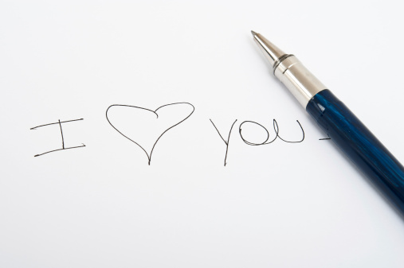
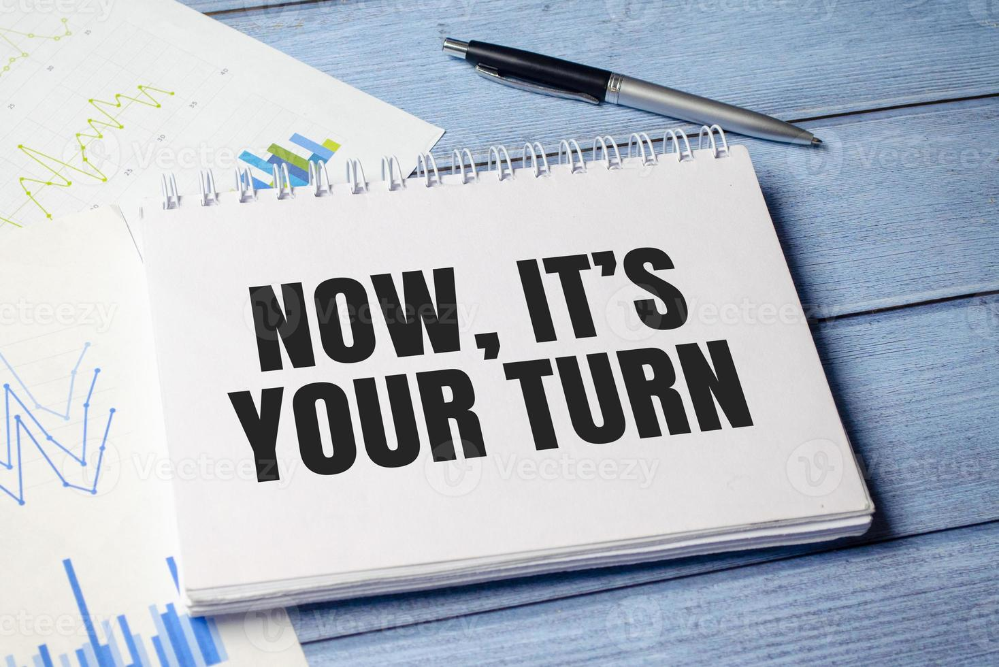
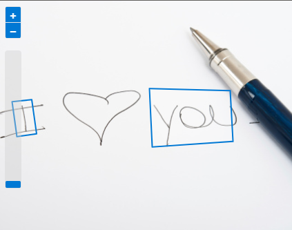
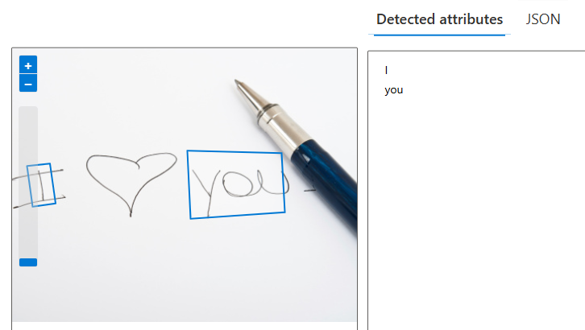
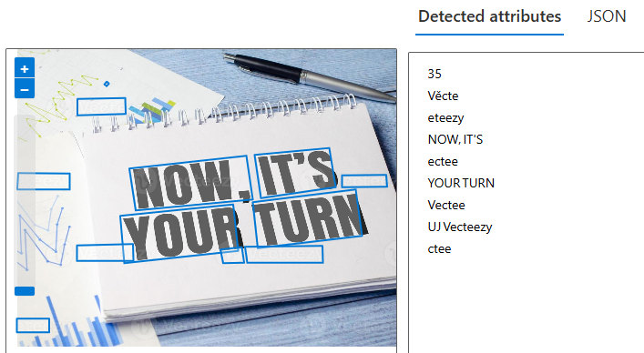

#  Reconhecimento Facial e transformação de imagens em Dados no Azure ML

## Índice

- [Reconhecimento Facial e transformação de imagens em Dados no Azure ML](#reconhecimento-facial-e-transformação-de-imagens-em-dados-no-azure-ml)
  - [Índice](#índice)
  - [Descrição](#descrição)
  - [Extraindo texto de imagens no Vision Studio](#extraindo-texto-de-imagens-no-vision-studio)
    - [Inputs](#inputs)
    - [Outputs](#outputs)
    - [Prints do Reconhecimento óptico de caracteres](#prints-do-reconhecimento-óptico-de-caracteres)
  - [Referências](#referências)

---
## Descrição
 Nesse projeto, foi utilizado o serviço Azure AI para explorar os recursos de reconhecimento óptico de caracteres do Azure AI Vision. Foi utilizado o Vision Studio para experimentar extrair texto de imagens, sem precisar escrever nenhum código.

Um desafio comum de visão computacional é detectar e interpretar texto incorporado em uma imagem. Isso é conhecido como reconhecimento óptico de caracteres (OCR). 

## Extraindo texto de imagens no Vision Studio

### Inputs

<figure style="text-align: center;">
    
    <figcaption>Imagem 1 usada.</figcaption>
</figure>

<figure style="text-align: center;">
    
    <figcaption>Imagem 2 usada.</figcaption>
</figure>

### Outputs

<figure style="text-align: center;">
    
    <figcaption>Resultado do reconhecimento de texto na imagem 1.</figcaption>
</figure>

<figure style="text-align: center;">
    
    <figcaption>Resultado do reconhecimento de texto na imagem 2.</figcaption>
</figure>

### Prints do Reconhecimento óptico de caracteres

<figure style="text-align: center;">
    
    <figcaption>Resultado do reconhecimento de texto na imagem 1 no Vision Studio.</figcaption>
</figure>

<figure style="text-align: center;">
    
    <figcaption>Resultado do reconhecimento de texto na imagem 2 no Vision Studio.</figcaption>
</figure>

## Referências

[Read text in Vision Studio](https://microsoftlearning.github.io/mslearn-ai-fundamentals/Instructions/Labs/05-ocr.html)

