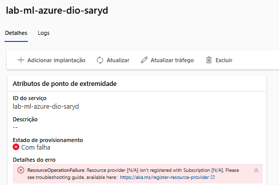

# Explorando o Machine Learning automatizado no Azure Machine Learning

# Índice

- [Explorando o Machine Learning automatizado no Azure Machine Learning](#explorando-o-machine-learning-automatizado-no-azure-machine-learning)
- [Índice](#índice)
  - [Descrição](#descrição)
  - [Passo 1: Criar um espaço de trabalho do Azure Machine Learning](#passo-1-criar-um-espaço-de-trabalho-do-azure-machine-learning)
  - [Passo 2: Usando aprendizado de máquina automatizado para treinar um modelo](#passo-2-usando-aprendizado-de-máquina-automatizado-para-treinar-um-modelo)
  - [Passo 3: Avaliação do melhor modelo](#passo-3-avaliação-do-melhor-modelo)
  - [Passo 4: Implantar e testar o modelo](#passo-4-implantar-e-testar-o-modelo)
  - [Teste do serviço implantado](#teste-do-serviço-implantado)
  - [Resumo](#resumo)
  - [Troubleshoot](#troubleshoot)
    - [Erro ao criar um ponto de extremidade on-line gerenciado no Azure Machine Learning Studio.](#erro-ao-criar-um-ponto-de-extremidade-on-line-gerenciado-no-azure-machine-learning-studio)
  - [Referências](#referências)

---

## Descrição
 Nesse laboratório, usaremos o recurso de machine learning automatizado no Azure Machine Learning para treinar e avaliar um modelo de machine learning. Em seguida, implantaremos e testaremos o modelo treinado. Será utilizado dados históricos de alugueis de bicicletas para treinar o modelo que irá prevê o número de alugués de bicicletas esparados em um determinado dia.

 ## Passo 1: Criar um espaço de trabalho do Azure Machine Learning

<figure style="text-align: center;">
    
    <figcaption>Criando workspace azure ML.</figcaption>
</figure>

<figure style="text-align: center;">
    
    <figcaption>Workspace criado no azure ML.</figcaption>
</figure>

## Passo 2: Usando aprendizado de máquina automatizado para treinar um modelo
 
 No Azure Machine Learning Studio , selecionar a página ML automatizado (em Criação) e criar um novo trabalho de ML automatizado.

 <figure style="text-align: center;">
    
    <figcaption>Trabalho criado e em execução.</figcaption>
</figure>

## Passo 3: Avaliação do melhor modelo

 <figure style="text-align: center;">
    
    <figcaption>Trabalho concluído, melhor algoritmo VotingEnsemble.</figcaption>
</figure>

 <figure style="text-align: center;">
    
    <figcaption>Em métricas, gráfico resíduos que mostra as diferenças entre valores previstos e reais com um histograma.</figcaption>
</figure>

 <figure style="text-align: center;">
    
    <figcaption>Em métricas, gráfico predict true compara os valores previstos com os valores verdadeiros.</figcaption>
</figure>

## Passo 4: Implantar e testar o modelo

 <figure style="text-align: center;">
    
    <figcaption>Implantantando o modelo escolhido em Ponto de extremidade em tempo real.</figcaption>
</figure>

## Teste do serviço implantado

 <figure style="text-align: center;">
    
    <figcaption> Dados de entrada para testar o ponto de extremidade e resultado obtido.</figcaption>
</figure>

JSOn completo usado.

```json   {
  "input_data": {
    "columns": [
      "day",
      "mnth",
      "year",
      "season",
      "holiday",
      "weekday",
      "workingday",
      "weathersit",
      "temp",
      "atemp",
      "hum",
      "windspeed"
    ],
    "index": [0],
    "data": [[27,2,2025,2,0,1,1,2,0.3,0.3,0.3,0.3]]
  }
 }
```

## Resumo
Nesse Laboratório, usamos um conjunto de dados históricos de aluguel de bicicletas para treinar um modelo. O modelo prevê o número de aluguéis de bicicletas esperados em um determinado dia, com base em características sazonais e meteorológicas.

## Troubleshoot
### Erro ao criar um ponto de extremidade on-line gerenciado no Azure Machine Learning Studio.

 <figure style="text-align: center;">
    
    <figcaption> rceOperationFailure.</figcaption>
</figure>

Esse erro ocorreu ao implantar o modelo escolhido. Se trata de três provedores de recursos que não estavam registrados ( Microsoft.Cnd, Microsoft.PolicyInsights e Microsoft.ApiManagement). O link a seguir demonstra como registrar os provedores mencionados.

[Error while creating a managed online endpoint](https://learn.microsoft.com/en-us/answers/questions/1983847/error-while-creating-a-managed-online-endpoint-in)


## Referências

[Explore Automated Machine Learning in Azure Machine Learning](https://microsoftlearning.github.io/mslearn-ai-fundamentals/Instructions/Labs/01-machine-learning.html)

[DIO - Microsoft - Fundamentos de IA](https://web.dio.me/track/microsoft-fundamentos-de-ia)


